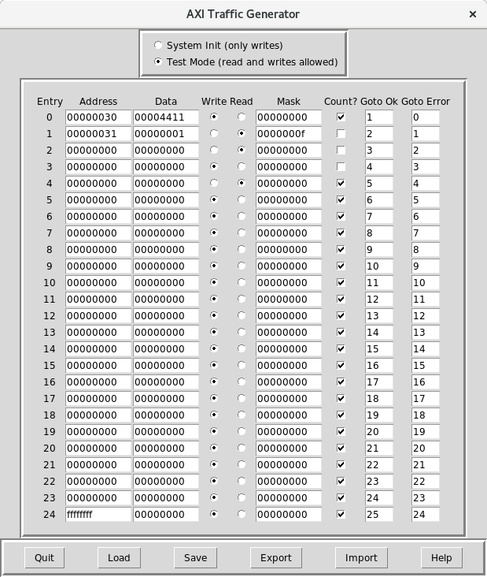
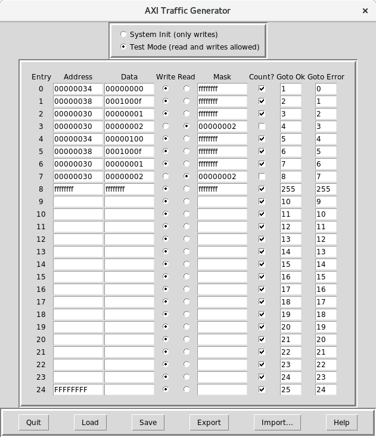

# axi-traffic-gen

File editor for the Xilinx AXI Traffic Generator IP

This Python/Tk script helps manage .coe files inputs to the ATG. It's limited to AXI-Lite transactions.
The AXI Traffic Generator reads 2 or 4 files with instructions how to issue AXI transactions, and usually these files are edited manually, which makes it cumbersome to keep aligned and synchronized but for the smallest of projects.

### Running

The script requires Python3 with Tkinter module, which should come with all Python3 installations by default.
On Fedora 28, I had to install the Tkinter module with the following:

    $ sudo dnf install python3-tkinter

To run the script:

    $ python3 atg.py

### Modes:

- System Init: only produces AXI Lite write commands, so only the Address and Data fields are required; other fields are ignored. Exporting won't save these ignored fields into files.
- Test Mode: this mode allows read and writes commands to be produced on the AXI-Lite interface. All fields are used and exported to files in this mode.

### Input:

- The Address, Data & Mask fields are interpreted as hexadecimal values. There's no need to prepend "0x" to the values.
- The Write/Read checkboxes select the type of transaction to be produced on the AXI interface. This field is ignored in System Init mode.
- The Count field refers to the "Count as Error" field in the Control COE file. Read transactions are compared against the Data+Mask field and if the Count? field is set, will increment the error count if a mismatch occurred. Write transactions monitor BRESP to be OKAY, and if not, the error counter is incremented. This error counter is present in the ATG instance as an output port.
- Goto Ok refers to the next entry to be executed if the current entry executes successfully. The entry is interpreted as a decimal value.
- Goto Err in turn, refers to the next entry to be executed if the current transaction failed. The entry is interpreted as a decimal value.

### Buttons:

- Quit: Exits the application, abandoning any edits.
- Load: Loads a data.atg file previously generated by this script, containing all fields as it was saved. Useful to restore all changes from one file.
- Save: Saves a data.atg file with the entire session presumably to resume at a later date. Note: It will overwrite a previously saved data.atg!
- Export: Saves two .coe files (addr.coe, data.coe) if in System Init mode, or all four .coe files (addr.coe, data.coe, mask.coe & ctrl.coe) if in Test Mode. Note: It will overwrite previously saved .coe files without warning.
- Import: Opens an import dialog that allows loading a .coe file to a selected column, ie. address, data, mask or control and populates the respective fields.

- Help: Basic information regarding modes.

### Limitations:

- Up to 25 transactions are possible, but this can easily be modified by setting the MAX_ROWS constant in the code. The ATG is limited to 256. I still haven't figured out exactly how to add scrollbars to show more transactions, and this is the reason behind the limitation, besides never needing more. Ping me if you know how.

### To-do:
- Add buttons to allow insertion and deletion of an entire row.
- Add scrollbars to allow more rows.

For information on the AXI Traffic Generator, please refer to Xilinx PG125 document.

